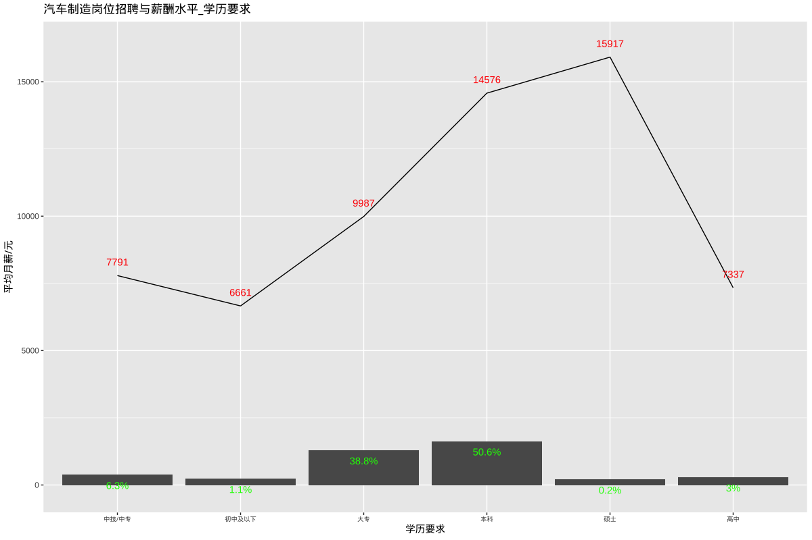

# 汽车制造招聘和薪酬水平

## 总述

本次采集有效数据2825条（城市发布量\>=100），主要分析汽车制造相关岗位招聘和薪酬，岗位如质量工程师、焊接工艺工程师、组装生产工程师、装配工艺工程师、冲压工艺工程师、涂装工艺工程师、项目工程师等。我们将从如下方面分析：

-   01.城市分布：主要在上海占30%，平均月薪14382元；其余城市均在11%或以下。

-   02.行业分布：汽车占90%，平均月薪11951元。

-   03.公司规模：1000人以下占63%，平均月薪11018元；1000-5000人占20%，平均月薪11879元。

-   04.公司类型：民企占44%，平均月薪12238元；外企占24%，平均月薪12212元。

-   05.工作经验：5年以下占73%，平均月薪10306元；5-10年占23%，平均月薪15513元。

-   06.学历要求：本科占51%，平均月薪14576元；大专占39%，平均月薪9987元。

## 01.城市分布

## 02.行业分布

## 03.公司规模

## 04.公司类型

## 05.工作经验

## 06.学历要求

